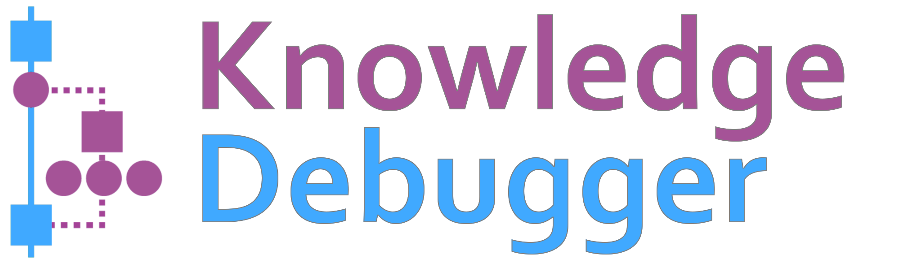

[//]: # (# Knowledge-Debugger 🔎 )
### 


[[Docs]](https://ebnz.github.io/lm-debugger/)

Knowledge-Debugger is an open-source interactive tool for inspection and knowledge editing in transformer-based language models. 
This repository includes the code and links for data files required for running Knowledge-Debugger on GPT2-XL. 
This tool is easily adaptable to other models, new knowledge editing methods and metrics. These modifications only require a few changes. 

We currently support GPT2-like models (stable) and Llama2-like models (experimental). 

Contributions are welcome!

### ⚙️ Requirements

The tool runs in a React and python environment with Flask and Streamlit installed. In addition, the exploration view uses an Elasticsearch index. To set up the environment, please follow the steps below:

1. Clone this repository:
   ```bash
   git clone https://github.com/ebnz/lm-debugger
   cd lm-debugger
   ```
2. Create a Python 3.10 environment and install dependencies
   ```bash
   conda env create --file=environment.yaml
   ```

4. Install [Yarn](https://yarnpkg.com/) and [NVM](https://github.com/nvm-sh/nvm), and set up the React environment:
   ```bash
   cd ui
   nvm install
   yarn install
   cd ..
   ```

5. Install [Elasticsearch](https://www.elastic.co/guide/en/elasticsearch/reference/current/install-elasticsearch.html) and make sure that the service is up.

### 🔎 Running Knowledge-Debugger

#### Creating a Configuration File 
Knowledge-Debugger executes one model at a time, based on a given configuration file. 
This file's config fields can be seen in the [Docs](https://ebnz.github.io/lm-debugger/).
Exemplary Files are provided in `config_files/`

#### Creating an Elasticsearch Index
The keyword search functionality in the exploration view is powered by an Elasticsearch index that stores the projections of feed-forward parameter vectors from the entire network. To create this index, run:
```bash
python es_index/index_value_projections_docs.py \
--config_path CONFIG_PATH
```

#### Executing Knowledge-Debugger

To run Knowledge-Debugger:
```bash
bash start.sh CONFIG_PATH
```

#### Adding an EasyEdit Knowledge-Editing Method
Simply create an EasyEdit-Hparams-File and store it in your EasyEdit Hparams-Path (default: `config_files/ee_hparams`).

------------------------------
In case you are interested in _running only one of the two views of Knowledge-Debugger_, this can be done as follows:

1. To run the Flask server (needed for the prediction view):
   ```bash
   python3 -m flask_server.app --config_path CONFIG_PATH
   ```

2. To run the prediction view:
   ```bash
   python ui/src/convert2runConfig.py --config_path CONFIG_PATH
   cd ui
   yarn start
   ```

3. To run the exploration view:
   ```bash
   streamlit run streamlit/exploration.py -- --config_path CONFIG_PATH
   ```

### Origins of Knowledge-Debugger
Knowledge-Debugger is based on LM-Debugger, originally developed by [Geva et al](https://arxiv.org/abs/2204.12130).

Online Demos of LM-Debugger are available here: 
- GPT2 Medium: https://lm-debugger.apps.allenai.org/
- GPT2 Large: https://lm-debugger-l.apps.allenai.org/

### Citation
Please cite as:
```bibtex
@article{geva2022lmdebugger,
  title={LM-Debugger: An Interactive Tool for Inspection and Intervention in Transformer-Based Language Models},
  author={Geva, Mor and Caciularu, Avi and Dar, Guy and Roit, Paul and Sadde, Shoval and Shlain, Micah and Tamir, Bar and Goldberg, Yoav},
  journal={arXiv preprint arXiv:2204.12130},
  year={2022}
}
```

Docs to be extended soon!